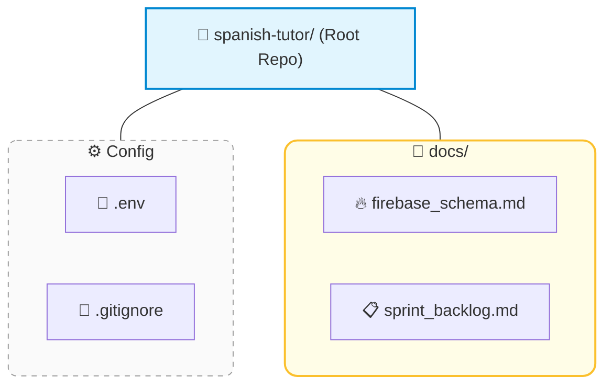

# SPANISH TUTOR APP: MASTER ARCHITECTURE & SPECIFICATIONS

## 1. Project Overview & Objectives

Here are the core objectives for the application:

* **Goal:** Iterative Python Streamlit web application providing interactive conversational Spanish practice and spaced-repetition (SRS) flashcard reviews[cite: 1, 3, 4, 7].
* **Target Dialect:** Latin American Spanish tailored for an advanced beginner focused on understanding TV shows and movies[cite: 1, 8, 9].
* **Deployment & Execution:** Hosted on macOS (VS Code) -> GitHub Repository -> Viewed on Mac or Samsung Galaxy phone browser via local Wi-Fi[cite: 1, 3, 7].

## 2. Technical Stack & Dependencies

The project relies on these core libraries and cloud services:

* **SDK Package:** `google-genai` (Connecting to `gemini-3.7-flash`)[cite: 1, 3, 4].
* **UI Framework:** `streamlit` (Single-file web application in `tutor.py`)[cite: 1, 3, 4].
* **Database / Cloud State:** Firebase Cloud Firestore (`google-cloud-firestore`) for real-time word banks and chat transcripts[cite: 1].
* **Secret Credentials:** `GEMINI_API_KEY`, `PEXELS_API_KEY`, and `firebase-key.json` loaded securely via local configuration files (Strictly excluded via `.gitignore`)[cite: 1, 3].

## 3. Database Schema (Firebase Firestore)

All data is stored under the primary user reference:

* **Base Reference:** `users/default_user/`
* **Subcollection 1:** `words/` (Document ID = Spanish Word)
  * Fields: `english`, `box` (1-5), `last_reviewed`, `next_review`, `image_url`[cite: 3]
* **Subcollection 2:** `chat_sessions/` (Document ID = Timestamp ID)
  * Fields: `timestamp`, `title`, `messages` array

## 4. Tutor Personas & Operational Rules

The AI tutor behaves according to these core guidelines:

* **Personas:** Gabriella "Gabby" (Default, warm, female voice)[cite: 3, 9] / Mateo (Secondary, male voice)[cite: 3, 9].
* **Language Pacing:** Speak primarily in Spanish; switch briefly to English for major grammar or structural corrections[cite: 3, 9].
* **Focus Areas:** Distinguish $r$ vs. $rr$ pronunciations and proper preposition usage (*por* vs. *para*)[cite: 3, 8, 9].
* **Automated Word Tracking:** Model appends hidden `[SAVE: spanish_word]` tags to responses when the user struggles; regex strips tags for display and updates Firestore[cite: 1, 3, 4].
* **Silence Helper:** Offer 3 short text suggestions if the user is silent for 5 seconds[cite: 9].

## 5. Visual UI Structure & Features (`tutor.py`) 

To do: reference praktica

### Tab 1: 💬 Conversation Practice

* Push-to-talk microphone input (`st.audio_input`) accepting raw audio bytes[cite: 3, 4].
* Auto-playing spoken tutor responses using TTS audio streams[cite: 3].
* Sidebar panel to load and review past chat history threads from Firestore.

### Tab 2: 🎴 Flashcard Deck

* Leitner Box SRS filtering (renders only words due for review today)[cite: 3, 4, 7].
* Dynamic Image Fetching: Queries Pexels API for thumbnail images on missing `image_url` fields and backfills Firestore.
* Spoken "Say the Word" Challenges: Random audio interjections prompting the user to speak Spanish translations, evaluated directly by Gemini.
* Pre-Made Decks Importer: One-click merging of starter topics (Numbers, Months, Body Parts) into Firestore.

## Directory and Documentation structure

